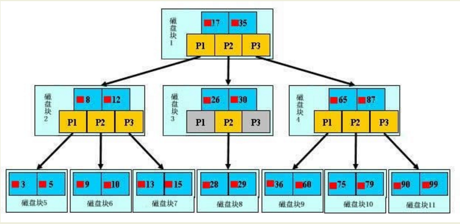

# MySQL 索引
MySQL索引的建立对于MySQL的高效运行是很重要的，索引可以大大提高MySQL的检索速度。

常见的索引类型有：主键索引、唯一索引、普通索引、全文索引、组合索引
## MySQL 索引原理
MySQL支持诸多存储引擎，而各种存储引擎对索引的支持也各不相同，因此MySQL数据库支持多种索引类型，如BTree索引，B+Tree索引，哈希索引，全文索引等。
### BTree索引
BTree是平衡搜索多叉树，设树的度为d（d>1），高度为h，那么BTree要满足以一下条件：

- 每个叶子结点的高度一样，等于h；

- 每个非叶子结点由n-1个key和n个指针point组成，其中d<=n<=2d,key和point相互间隔，结点两端一定是key；

- 叶子结点指针都为null；

- 非叶子结点的key都是[key,data]二元组，其中key表示作为索引的键，data为键值所在行的数据；

BTree的结构如下：

在BTree的机构下，就可以使用二分查找的查找方式，查找复杂度为h*log(n)，一般来说树的高度是很小的，一般为3左右，因此BTree是一个非常高效的查找结构。
### B+Tree索引
B+Tree是BTree的一个变种，设d为树的度数，h为树的高度，B+Tree和BTree的不同主要在于：

- B+Tree中的非叶子结点不存储数据，只存储键值；

- B+Tree的叶子结点没有指针，所有键值都会出现在叶子结点上，且key存储的键值对应的数据的物理地址；

一般来说B+Tree比BTree更适合实现外存的索引结构，因为存储引擎的设计专家巧妙的利用了外存（磁盘）的存储结构，即磁盘的一个扇区是整数倍的page（页），页是存储中的一个单位，通常默认为4K，因此索引结构的节点被设计为一个页的大小，然后利用外存的“预读取”原则，每次读取的时候，把整个节点的数据读取到内存中，然后在内存中查找，已知内存的读取速度是外存读取I/O速度的几百倍，那么提升查找速度的关键就在于尽可能少的磁盘I/O，那么可以知道，每个节点中的key个数越多，那么树的高度越小，需要I/O的次数越少，因此一般来说B+Tree比BTree更快，因为B+Tree的非叶节点中不存储data，就可以存储更多的key。

### 全文索引：
FULLTEXT（全文）索引，仅可用于MyISAM和InnoDB，针对较大的数据，生成全文索引非常的消耗时间和空间。对于文本的大对象，或者较大的CHAR类型的数据，如果使用普通索引，那么匹配文本前几个字符还是可行的，但是想要匹配文本中间的几个单词，那么就要使用LIKE %word%来匹配，这样需要很长的时间来处理，响应时间会大大增加，这种情况，就可使用时FULLTEXT索引了，在生成FULLTEXT索引时，会为文本生成一份单词的清单，在索引时及根据这个单词的清单来索引。

* 对于较大的数据集，把数据添加到一个没有FULLTEXT索引的表，然后添加FULLTEXT索引的速度比把数据添加到一个已经有FULLTEXT索引的表快。
* MySQL自带的全文索引只能用于MyISAM存储引擎，如果是其它数据引擎，那么全文索引不会生效。

* 在MySQL中，全文索引支队英文有用，目前对中文还不支持。

* 在MySQL中，如果检索的字符串太短则无法检索得到预期的结果，检索的字符串长度至少为4字节，此外，如果检索的字符包括停止词，那么停止词会被忽略。

### 哈希索引：
只有memory（内存）存储引擎支持哈希索引，哈希索引用索引列的值计算该值的hashCode，然后在hashCode相应的位置存执该值所在行数据的物理位置，因为使用散列算法，因此访问速度非常快，但是一个值只能对应一个hashCode，而且是散列的分布方式，因此哈希索引不支持范围查找和排序的功能。

## 索引分类
### 普通索引

### 唯一索引
索引列的值必须唯一，但允许有空值。如果是组合索引，则列值的组合必须唯一
### 主键索引
即主索引，根据主键建立索引，不允许重复，不允许空值；
### 全文索引
用大文本对象的列构建的索引
### 组合索引
用多个列组合构建的索引，这多个列中的值不允许有空值